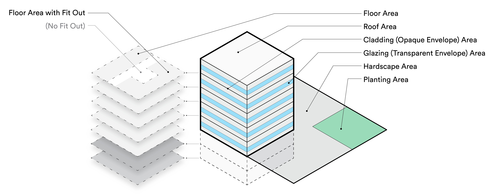

# Introduction to C.Scale

## Welcome to C.Scale!

**C.Scale** is a whole life carbon calculation engine estimating emissions from the construction, renovation, and operation of buildings. **When highly-detailed energy modeling and life cycle assessment aren't affordable or practicable, teams use C.Scale.**

C.Scale is designed for use during site and feasibility studies, requests for proposals, pre-design, in retrospective analysis, or in other situations where a whole-building life cycle assessments and/or energy models are not practicable.&#x20;

The model allows a user to enter a strict minimum of project parameters to test a wide range of the most meaningful carbon reductions strategies. It is the calculation engine behind numerous web applications and research efforts focused on both forward-looking planning and retrospective analysis of carbon emissions from buildings and the built environment.

We ship features continuously, and have an exciting roadmap for the year ahead. Features are developed in response to user feedback, to incorporate improved data, and to refine the tool's methodology. Something you'd like to see? Reach out.&#x20;

## C.Scale calculates whole life carbon emissions

C.Scale integrates embodied, operational, and landscape carbon emission assessment into a single model. By taking a 'whole carbon' view, C.Scale prevents burden shifting and ensures that a project team has the information necessary to target the most impactful carbon reductions.

C.Scale uses GWP-100 characterization factors.

## C.Scale describes typical buildings

Every attempt has been made to ensure that C.Scale's results describe a typical building (i.e. a building similar to those in our database) whose characteristics match those you enter in the tool. However, unreported characteristics may make a particular building atypical in ways that it is beyond the scope of C.Scale to describe.&#x20;

For instance, the use of particularly high-carbon and high-cost finish materials (e.g., a building where all the millwork is in gold leaf) is not well-described by C.Scale. It is impossible to preemptively describe all cases where C.Scale might deviate from a particular building (the possibilities are literally endless) but, as your project progresses, we recommend that your project team remains aware of how any deviation from "typical" design will affect the project's climate goals.

## C.Scale is a time series model

In the built environment, it is essential to understand the [time value of carbon](https://carbonleadershipforum.org/the-time-value-of-carbon/). To this end, C.Scale uses time series data to analyze carbon emissions across a building's life. For each year in the analysis period (defined by the project's [time horizon](<README (1).md#time-horizon>)), C.Scale estimates all emissions occurring in that year.

**In the first year**, the following emissions are always calculated:

* Embodied emissions in construction materials (life cycle stages A1-A3)
* Construction site emissions (life cycle stages A4-A5)
* Storage of biogenic carbon in timber structural components (life cycle stage D)

**In each year**, the following emissions are always calculated:

* Operational carbon emissions from onsite fossil fuel use (life cycle stage B6)
* Operational carbon emissions from onsite electricity use (life cycle stage B6)
* Emissions from landscape maintenance, when applicable (life cycle stage B2)

**In only some years,** the following emissions are always calculated:

* Replacement and refurbishment of hardscape (life cycle stages B3-B5)
* Replacement and refurbishment of the building envelope (life cycle stages B3-B5)
* Replacement and refurbishment of interior fit-out (life cycle stages B3-B5)
* Replacement and refurbishment of MEP and PV systems (life cycle stages B3-B5)

## Building Geometry in C.Scale

C.Scale's calculations are based on area and material takeoffs from simple building geometry. A diagram of this building geometry is provided below.

<figure><figcaption></figcaption></figure>

## C.Scale customizable and extensible

C.Scale is built as a series of modules, each connected to the others and tasked with a specific set of calculations. These modules are added or expanded in response to the requests of users.

The C.scale model's assumptions and background data can be overriden or refined through additional inputs. This allows for the addition of project-specific data where it is available while maintaining the C.Scale model for calculating all other parts of the project's carbon footprint. For more information on how this works, check out our Swagger docs or reach out for a conversation.
