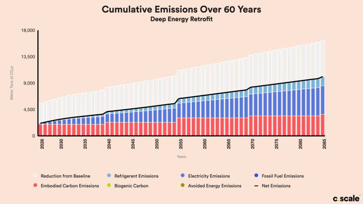

# ⚡ Chart Exports

Exporting graphics was a highly requested feature! To get started, click the **Download button** located on the right side of all the charts available on C.Scale.

<figure><figcaption>
Download button.
</figcaption></figure>

From the drop-down, choose to download the chart in either **PNG** or **PDF** format.

<figure><figcaption>
Choose to download in PNG or PDF format.
</figcaption></figure>

The PNG is downloaded with a **transparent format** so it can be added to your presentations. Below is an example of how it will look.

<figure><figcaption>
C.Scale chart as a transparent PNG with a colored background.
</figcaption></figure>

