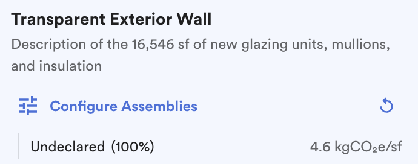

# 5️⃣ Create a Portfolio

A **Portfolio** lets you compare all active projects in your organization across the same scope categories and LCA stages, ensuring consistency and normalization for an _"apples to apples"_ comparison.

From the Organization Dashboard, begin by clicking the **+ New Portfolio** button.&#x20;

<figure><figcaption>
Create your portfolio.
</figcaption></figure>

Portfolios can be created to be either **Static** or **Dynamic.**&#x20;

1. <mark style="color:green;">**`Static Portfolios:`**</mark>

You can manually add projects to create a **Static Portfolio.**

<figure><figcaption>
Create Static Portfolio.
</figcaption></figure>

Projects can be added once to create a Static Portfolio.

<figure><figcaption>
Choose Projects to be added to the Static Portfolio.
</figcaption></figure>

Fill in the required information and click **Create**.

<figure><figcaption>
In a few simple steps, create a new portfolio. 
</figcaption></figure>

2. <mark style="color:green;">**`Dynamic Portfolios:`**</mark>

Dynamic portfolios can be created by using filters for **Primary Use Case.**

<figure><figcaption>
Create Dynamic Portfolio.
</figcaption></figure>

Select the **Primary Use Case,** and the app will automatically add all the Projects in your Organization to the Portfolio. C.Scale will also **automatically** include any new projects with the same Primary Use Case into the Dynamic Portfolio.

<figure><figcaption>
Choose Primary Use Case to be added to the Dynamic Portfolio.
</figcaption></figure>

Fill in the required information and click **Create**.

<figure><figcaption>
In a few simple steps, create a new portfolio. 
</figcaption></figure>

After creation, click on the desired **Portfolio Name** to open up the portfolio view.

<figure><figcaption>
Portfolio view across projects.
</figcaption></figure>

<mark style="color:green;">**`Note:`**</mark> All projects within the Portfolio are compared based on the [target scenarios](../compare-scenarios/set-target-scenario.md) set within the project.&#x20;

