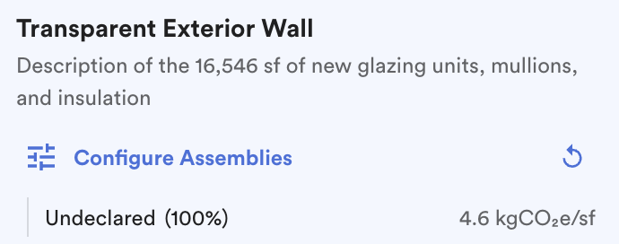

# Enclosure

### Enclosure Specification

The specification of the enclosure assemblies. C.Scale includes a dynamic enclosure model which allows users to input very general data (when very little is known) or very specific data (during later stages of design). When specific data is not known, the app includes C.Scale's pre-defined carbon intensities, defined by the levels of ambition.

Enclosure Specification Choices (Carbon Intensity)

* **Low Carbon (20th percentile).** 20th percentile of GWP for solid exterior wall, transparent exterior wall and roofing assemblies.&#x20;

- **Average (50th percentile).** 50th percentile of GWP for for solid exterior wall, transparent exterior wall and roofing assemblies.&#x20;

* **High Carbon (80th percentile).** 80th percentile of GWP for solid exterior wall, transparent exterior wall and roofing assemblies.&#x20;

<figure><figcaption>
Choose from pre-defined enclosure carbon intensities.
</figcaption></figure>

#### Enclosure Service Life

The length of time over which a majority of the enclosure will be replaced.

### Solid Exterior Wall Specification

The specification of the solid exterior wall assemblies. These specification levels do not describe specific assemblies. When specific data is not known, the C.Scale app includes pre-defined carbon intensities, defined by the levels of ambition. When more data is available, C.Scale allows you to define specific cladding assemblies, exterior insulation types, and wall framing assemblies. C.Scale will use your description of the solid exterior wall (i.e., any declarations of specific materials) to subset our library of solid exterior wall assemblies (\~1200) to only those meeting your criteria. This allows the user to know the range of potential carbon intensities available both within and between their declared design.

Solid Exterior Wall Specification Choices (Carbon Intensity)

* **Low Carbon (20th percentile).** 20th percentile of GWP for solid exterior wall assemblies.&#x20;

- **Average (50th percentile).** 50th percentile of GWP for solid exterior wall assemblies.&#x20;

* **High Carbon (80th percentile).** 80th percentile of GWP for solid exterior wall assemblies.&#x20;

**Solid Exterior Wall Reuse**

The reuse of solid exterior wall for a given percentage of the building’s total enclosure. _Note that these measures only affect upfront emissions; refurbishments are counted normally._

#### Solid Exterior Wall Service Life

The length of time over which a majority of the solid exterior wall will be replaced.

#### Solid Exterior Wall Assemblies Configurator

The Solid Exterior Wall Assemblies Configurator is designed to support the input of more detailed, project-specific data.

To begin using this feature, turn on **Use Assemblies** within the Enclosure accordion.

<figure><figcaption>
Turn on the Use Assemblies within accordion.
</figcaption></figure>

Once turned on, click the **Configure Assemblies** to start editing Solid Exterior Wall Assemblies.

<figure><figcaption>
Click on Configure Assemblies.
</figcaption></figure>

This opens up a **pop-out** for Enclosure Assembly Configurator. This automatically generates an R-Value, Service Life, and Carbon Intensity, which can be changed as needed.&#x20;

<figure><figcaption>
Customize Solid Exterior Wall Assembly options in pop-out.
</figcaption></figure>

You can choose the assembly options as you see fit to tailor them to your requirements. These options will continue to evolve based on ongoing feedback.



* Thin Brick
* EIFS
* Fiber Cement
* Wood Siding
* Profiled Metal Panel
* Composite Metal Panel
* Glass Fiber Reinforced Concrete
* Stone Veneer
* Terracotta



* Mineral Wool
* Polylso
* XPS
* EPS



* 6 in. CMU
* 6 in. Metal Stud
* 2x6 Wood Stud



To add more Solid Exterior Wall Assemblies, simply click on the **New Assembly** button.

<figure><figcaption>
Create a new Assembly.
</figcaption></figure>

Customize as needed and ensure the **Area(%)** adds up to a 100%, validating the area.&#x20;

<figure><figcaption>
Customize all solid wall assemblies and validate. 
</figcaption></figure>

When you click Update, depending on the choices made, the **Life Cycle Emissions chart** pertaining to the Enclosure assemblies will change.

<figure><figcaption>
Life Cycle Emissions chart before changes.
</figcaption></figure>

<figure><figcaption>
Life Cycle Emissions chart after changes.
</figcaption></figure>

Click out of the Enclosure Assembly Configurator to see changes to the carbon emissions values in the **Enclosure accordion**.

<figure><figcaption>
Updated carbon emissions values in Enclosure accordion.
</figcaption></figure>

### Transparent Exterior Wall Specification

The specification of the transparent exterior wall assemblies. These specification levels do not describe specific assemblies. When specific data is not known, the C.Scale app includes pre-defined carbon intensities, defined by the levels of ambition. When more data is available, C.Scale allows you to define specific glazing units, mullions, and insulation. C.Scale will use your description of the transparent exterior wall (i.e., any declarations of specific materials) to subset our library of transparent exterior wall assemblies (\~1200) to only those meeting your criteria. This allows the user to know the range of potential carbon intensities available both within and between their declared design.

Transparent Exterior Wall Specification Choices (Carbon Intensity)

* **Low Carbon (20th percentile).** 20th percentile of GWP for transparent exterior wall assemblies.&#x20;

- **Average (50th percentile).** 50th percentile of GWP for transparent exterior wall assemblies.&#x20;

* **High Carbon (80th percentile).** 80th percentile of GWP for transparent exterior wall assemblies.&#x20;

**Transparent Exterior Wall Reuse**

The reuse of transparent exterior wall for a given percentage of the building’s total enclosure. _Note that this measure only affects upfront emissions; refurbishments are counted normally._&#x20;

#### Transparent Exterior Wall Service Life

The length of time over which a majority of the transparent enclosure will be replaced.

#### Transparent Exterior Wall Assemblies Configurator

The Transparent Exterior Wall Assemblies Configurator is designed to support the input of more detailed, project-specific data.

To begin using this feature, turn on **Use Assemblies** within the Enclosure accordion.

<figure><figcaption>
Turn on the Use Assemblies within accordion.
</figcaption></figure>

Once turned on, click the **Configure Assemblies** to start editing Transparent Exterior Wall Assemblies.

<figure><figcaption>
Click on Configure Assemblies.
</figcaption></figure>

This opens up a **pop-out** for Enclosure Assembly Configurator. This automatically generates a Service Life and Carbon Intensity, which can be changed as needed.&#x20;

<figure><figcaption>
Customize Transparent Exterior Wall Assembly options in pop-out.
</figcaption></figure>

You can choose the assembly options as you see fit to tailor them to your requirements. These options will continue to evolve based on ongoing feedback.



* Curtain Wall



* Double-Glazed IGU
* Triple-Glazed IGU
* Closed Cavity Facade



* Aluminium
* Timber/Aluminium



To add more Transparent Exterior Wall Assemblies, simply click on the **New Assembly** button.

<figure><figcaption>
Create a new Assembly.
</figcaption></figure>

Customize as needed and ensure the **Area(%)** adds up to a 100%, validating the area.&#x20;

<figure><figcaption>
Customize all transparent wall assemblies and validate. 
</figcaption></figure>

When you click Update, depending on the choices made, the **Life Cycle Emissions chart** pertaining to the Enclosure assemblies will change.

<figure><figcaption>
Life Cycle Emissions chart before changes.
</figcaption></figure>

<figure><figcaption>
Life Cycle Emissions chart after changes.
</figcaption></figure>

Click out of the Enclosure Assembly Configurator to see changes to the carbon emissions values in the **Enclosure accordion**.

<figure><figcaption>
Updated carbon emissions values in Enclosure accordion.
</figcaption></figure>

### Roofing Specification

The specification of the roofing assemblies. These specification levels do not describe specific assemblies. Instead, they approximate the 80th, 50th, and 20th percentile of the distribution of all roofing options.&#x20;

Roofing Specification Choices (Carbon Intensity)

* **Low Carbon (20th percentile).** 20th percentile of GWP for roofing assemblies.&#x20;

- **Average (50th percentile).** 50th percentile of GWP for roofing assemblies.&#x20;

* **High Carbon (80th percentile).** 80th percentile of GWP for roofing assemblies.&#x20;

<figure><figcaption>
Choose from pre-defined roofing carbon intensities.
</figcaption></figure>

**Roofing Reuse**

The reuse of the roofing assembly for a given percentage of the building’s total roof area. _Note that these measures only affect upfront emissions; refurbishments are counted normally._&#x20;

#### Roofing Service Life

The length of time over which a majority of the roofing will be replaced.
